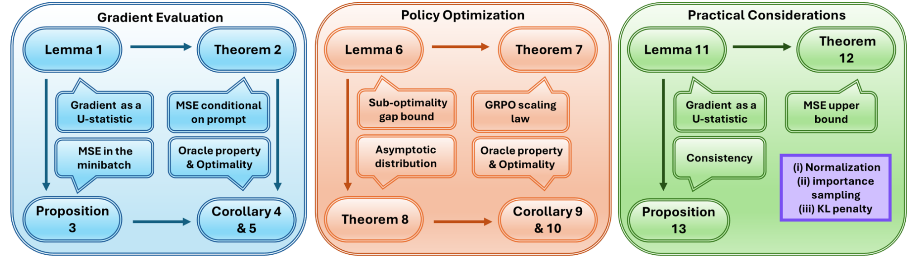
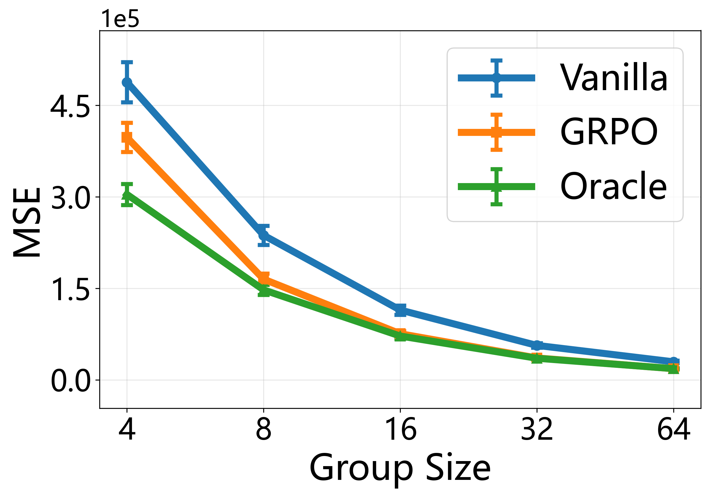
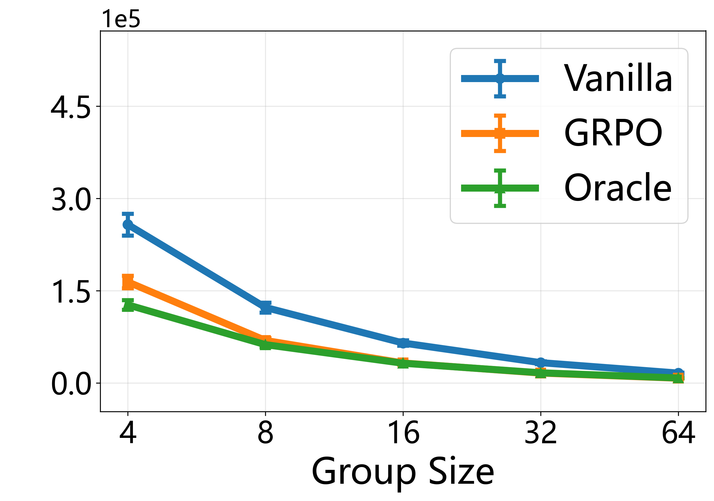
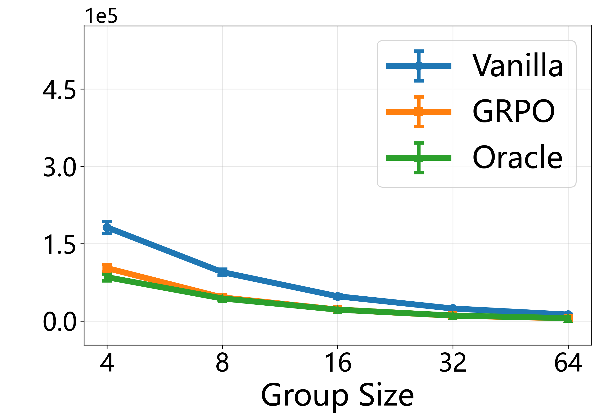

# Demystifying GRPO: Its Policy Gradient is a U-Statistic

[](https://arxiv.org/abs/2603.01162)
[](https://huggingface.co/datasets/Kyleyee/arithmetic-few-shot)
[](https://huggingface.co/datasets/Kyleyee/arithmetic-test)

This repository provides the code for reproducing the empirical results reported in the paper:

*Zhou et al., Demystifying Group Relative Policy Optimization: Its Policy Gradient is a U-Statistic.*


## 🗺️ Project Roadmap

The roadmap below summarizes our papers main results about gradient analysis, and policy optimization.

<p align="center">
    
</p>

Our experiments contain two parts:

1. Evaluation of the MSE of GRPO-type policy gradients (Zhou et al., Section 5.1).
2. GRPO-type policy optimization based on VERL (Zhou et al., Section 5.2).

## 🤗 Resources

- Paper page: https://arxiv.org/abs/2603.01162
- Dataset (few-shot): https://huggingface.co/datasets/Kyleyee/arithmetic-few-shot
  * For evaluating policy gradients of the ICL model (Zhou et al., Figure 4c)
- Dataset (naive): https://huggingface.co/datasets/Kyleyee/arithmetic-test
  * For evaluating policy gradients of Base and Instruct models (Zhou et al., Figure 4a & 4b)

## 🎯 What This Repository Contains

- [Gradient_evaluation/calculate_oracle_v.py](Gradient_evaluation/calculate_oracle_v.py)
Computes per-prompt oracle value function via Monte Carlo rollouts for evaluating the gradient of the Oracle algorithm.

- [Gradient_evaluation/run_tracecov.py](Gradient_evaluation/run_tracecov.py)
Evaluates MSEs of Vanilla, GRPO, and Oracle policy gradients. Since all three estimators are unbiased, their MSEs are equal to the traces of their covariance matrices.

- [Policy_Optimization/grpo_train.sh](Policy_Optimization/grpo_train.sh)
A simple GRPO training launcher (no containers required) with wandb support and easy-to-edit configuration.

## 🧩 Installation

The dependencies follow TRL and VERL ecosystems.

- TRL: https://github.com/huggingface/trl
- VERL: https://github.com/volcengine/verl

For policy optimization, please follow the VERL installation guide.
For gradient evaluation, a minimal environment required is:

```bash
conda create -n demystifying-grpo python=3.10 -y
conda activate demystifying-grpo
pip install torch transformers datasets pandas matplotlib tqdm pyarrow
```

If you run [Policy_Optimization/grpo_train.sh](Policy_Optimization/grpo_train.sh), install VERL in the same environment according to its official guide.
We strongly recommend enabling Weights & Biases (wandb) to monitor training curves, metrics, and checkpoints.

## 🖥️ Recommended GPU Requirements

- Gradient-side evaluation experiment: 1 GPU with 48GB+ VRAM
- GRPO Training: 4+ GPUs with 96GB+ VRAM each

## 🚀 Quick Start

### 1. Compute Oracle V

Few-shot dataset:

```bash
python Gradient_evaluation/calculate_oracle_v.py \
    --model Qwen/Qwen2.5-0.5B-Instruct \
    --dataset Kyleyee/arithmetic-few-shot \
    --split train \
    --n_oracle 1000 \
    --out_dir outputs/oracle_v
```

Naive dataset:

```bash
python Gradient_evaluation/calculate_oracle_v.py \
    --model Qwen/Qwen2.5-0.5B-Instruct \
    --dataset Kyleyee/arithmetic-test \
    --split train \
    --n_oracle 1000 \
    --out_dir outputs/oracle_v
```

If your dataset revision uses different split names, update the split value.

### 2. Run Trace-Covariance Evaluation

With plotting:

```bash
python Gradient_evaluation/run_tracecov.py \
    --model Qwen/Qwen2.5-0.5B-Instruct \
    --oracle_table outputs/oracle_v/your_oracle_table.jsonl \
    --save_json outputs/tracecov_json \
    --plot_path outputs/tracecov_plot
```

Without plotting:

```bash
python Gradient_evaluation/run_tracecov.py \
    --model Qwen/Qwen2.5-0.5B-Instruct \
    --oracle_table outputs/oracle_v/your_oracle_table.jsonl \
    --save_json outputs/tracecov_json \
    --skip_plot
```

### 3. Run Policy Optimization

Before running, edit the configuration section in [Policy_Optimization/grpo_train.sh](Policy_Optimization/grpo_train.sh) and we provide some examples below:

```bash
# 1) Path Configuration
CONDA_ROOT="/path/to/miniconda3"
ENV_NAME="verl_env"
REPO_DIR="/path/to/Demystifying_GRPO"
BASE="/path/to/workdir"

# 2) Model and Data Paths
MODEL="Qwen/Qwen2.5-Math-7B"
DATA_DIR="/path/to/parquet_data"
TRAIN_FILE="train.parquet"
VAL_FILE="test.parquet"

# 3) GPU Configuration
GPUS=4
export CUDA_VISIBLE_DEVICES="0,1,2,3"
GPU_UTIL=0.8
NNODES=1

# 4) Training Configuration
PYTHON_BIN="python"
GROUP_SIZE="8"
RUN_TAG="math_g8"
EXPERIMENT_NAME="math_g8"
PROJECT_NAME="demystifying_grpo"
```

Then run:

```bash
bash Policy_Optimization/grpo_train.sh
```

Note:
If you use provided datasets for policy optimization, convert them into parquet files first, then set DATA_DIR, TRAIN_FILE, and VAL_FILE in [Policy_Optimization/grpo_train.sh](Policy_Optimization/grpo_train.sh).

## 📈 Recommended: Monitor Training with Weights & Biases

For policy optimization runs, we recommend using wandb for real-time monitoring and experiment tracking.

1. Install and login:

```bash
pip install wandb
wandb login
```

2. Configure experiment identity in [Policy_Optimization/grpo_train.sh](Policy_Optimization/grpo_train.sh):

- Set PROJECT_NAME to your wandb project.
- Set EXPERIMENT_NAME to your run name.

3. Launch training as usual:

```bash
bash Policy_Optimization/grpo_train.sh
```

The launcher already uses wandb logging in the trainer logger configuration, so after login, metrics should appear automatically on your wandb dashboard.

Optional:
If you need offline logging on restricted clusters, you can run with WANDB_MODE=offline and sync later.

## 📊 Our Results

<p align="center">
    
    
    
</p>

<p align="center">
    <strong>Base</strong> | <strong>Instruct</strong> | <strong>Few-shot</strong>
</p>


## 🔄 Policy Optimization Notes

- [Policy_Optimization/grpo_train.sh](Policy_Optimization/grpo_train.sh) performs input validation for paths and core training hyperparameters before launching training.
- The script is machine-path neutral and avoids container-only setup, so it is easier to reuse in different environments.
- For more advanced policy optimization configuration options, refer to VERL examples and docs:
https://github.com/volcengine/verl

## 📝 Citation

If this repository is useful in your work, please cite:

```bibtex
@article{zhou2026demystifying,
  title={Demystifying group relative policy optimization: Its policy gradient is a u-statistic},
  author={Zhou, Hongyi and Ye, Kai and Xu, Erhan and Zhu, Jin and Yang, Ying and Gong, Shijin and Shi, Chengchun},
  journal={arXiv preprint arXiv:2603.01162},
  year={2026}
}
```

## 🙋 Support

For questions and issues:
- Open an issue on GitHub
- Check existing issues for solutions
- Email us

## 🔗 Related Resources


- [veRL Framework](https://github.com/volcengine/verl) - For GRPO training
- [HuggingFace Datasets](https://huggingface.co/docs/datasets/) - Dataset management
- [Transformers](https://huggingface.co/docs/transformers/) - Model library
- [TRL (Transformer Reinforcement Learning)](https://github.com/huggingface/trl) - For SFT training
